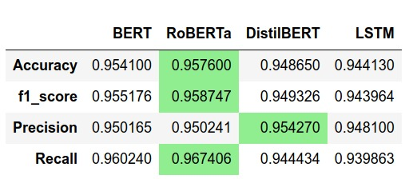
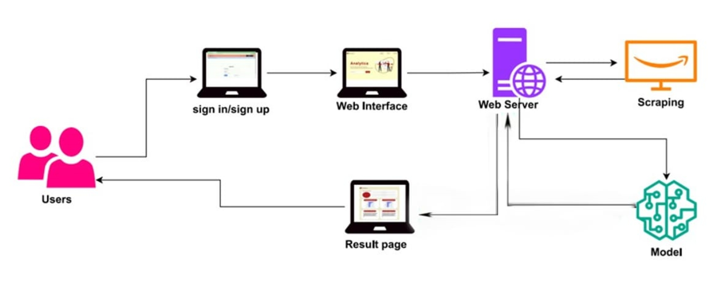
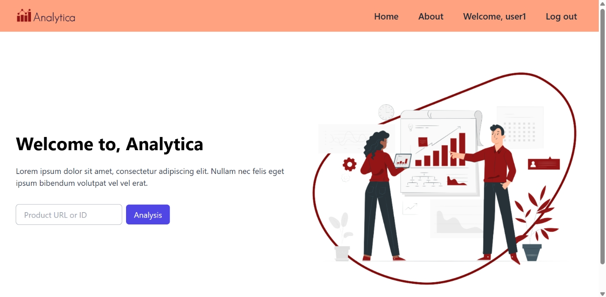
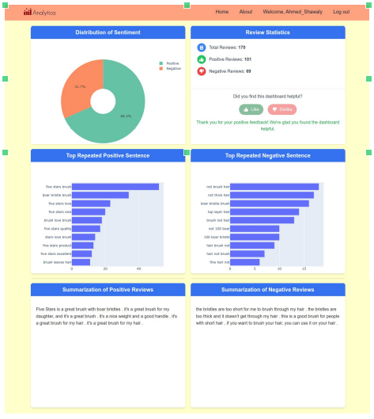

# Analytica Web App for Amazon Reviews Sentiment Analysis and Summarization

## 🎓 Graduation Project

## 📌 Project Overview
**Analytica** is a web application that helps users understand customer opinions from a large number of Amazon product reviews. Reading hundreds of reviews takes a lot of time, so this system uses **Natural Language Processing (NLP)** and **deep learning** to analyze reviews automatically.

The application is useful for two main groups:
- **Customers**: They can quickly know if a product is good or bad before buying it.
- **Retailers**: They can understand what customers like and dislike about their products, improve weaknesses, and highlight strengths.

---

## 🚀 Key Features
-  **Sentiment Analysis**: Classifies reviews as positive, negative, or neutral.
-  **Review Summarization**: Generates short summaries for positive and negative reviews.
- **Pros and Cons Detection**: Shows the most repeated good and bad opinions.
- **Interactive Dashboard**: Displays charts, statistics, and summaries.
- **Machine Learning Models**: Uses modern NLP models for better accuracy.
- **Web Scraping**: Automatically collects reviews from Amazon.
- **User Authentication**: Login, registration, and password reset.

---

## 🧠 Models and Techniques

### 🔹 Sentiment Analysis
Several models were trained and tested to choose the best one:





**RoBERTa** achieved the best performance and was selected for the final system.  
The model was exported to **ONNX** format for faster inference.

### 🔹 Text Summarization
- Model used: **T5-small**
- Summarizes positive and negative reviews separately
- Helps users understand opinions quickly without reading many reviews

---

## 🕸️ Web Scraping
- Tool used: **BeautifulSoup**
- Reviews are collected from Amazon product pages
- **ScrapeOps Proxy** is used to rotate IP addresses and avoid blocking
- Collected data is cleaned before analysis

---

## 🏗️ System Architecture
1. Users sign up or log in
2. The user enters an Amazon product URL or ID
3. The server scrapes reviews from Amazon
4. NLP models analyze sentiment and generate summaries
5. Results are displayed on the dashboard

### High-Level Architecture



---

## 📊 Application Screenshots

### Home Page


### Dashboard



---

## 📂 Project Structure
```
.
├── analytica/               # Main Flask application
├── imgs/                    # Screenshots and diagrams
├── models/                  # Pretrained NLP models
├── jupyter_notebooks/       # Training and experiments
├── docs/                    # Project documentation
├── config.py                # Application configuration
├── run.py                   # Application entry point
└── README.md
```


---

## ✅ Conclusion
Analytica is a practical web application that transforms customer reviews into useful insights. It saves time for customers and helps retailers understand feedback using modern NLP and deep learning techniques.

---

⭐ If you find this project useful, feel free to give it a star!
